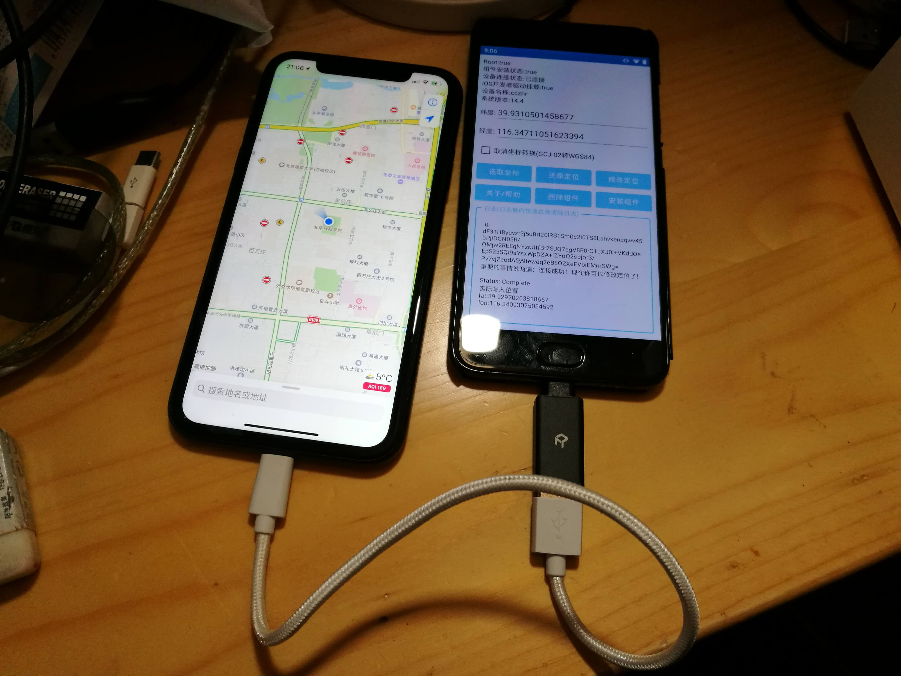
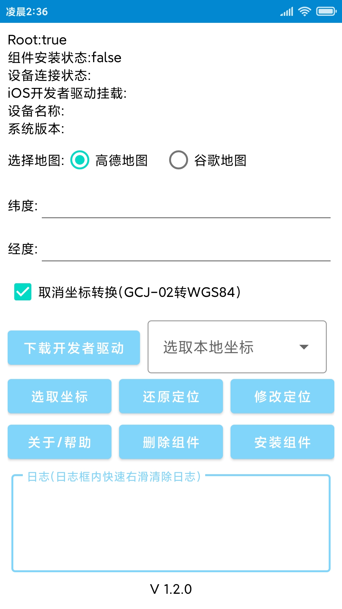
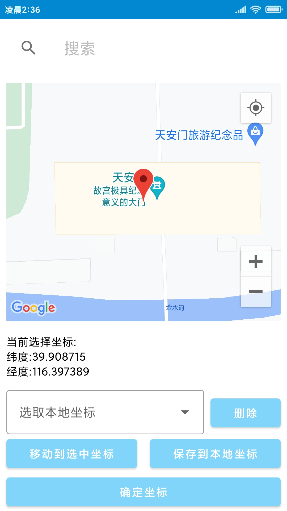

# OTGLocation
[开发者驱动下载](https://github.com/cczhr/OTGLocation/issues/17)     
[ios16+用户请查看](https://github.com/cczhr/OTGLocation/issues/19)    

This project is based on the [libimobiledevice](https://github.com/libimobiledevice) open source library development, and realizes that the Android device OTG can modify the longitude and latitude of the iPhone after connecting to the iPhone.

If you need the executable files and library files transplanted from [libimobiledevice](https://github.com/libimobiledevice)  open source project to Android platform, you can go to  [libimobiledevice_android](https://github.com/cczhr/libimobiledevice_android) to view them. I compiled some of them

Location selection support Amap and Google map

[Operation video](https://www.bilibili.com/video/BV1MZ4y1P7K3)

本项目基于[libimobiledevice](https://github.com/libimobiledevice)开源项目开发，实现了Android设备OTG连接iPhone后，可以修改iPhone的经纬度的功能。

如果你需要 [libimobiledevice](https://github.com/libimobiledevice) 开源项目移植到Android平台的可执行文件和库文件可以到 [libimobiledevice_android](https://github.com/cczhr/libimobiledevice_android)查看，我编译了部分。

位置选择支持高德地图以及谷歌地图

[演示视频](https://www.bilibili.com/video/BV1MZ4y1P7K3)

   
   
   
   

大佬请我喝快乐水专用码╭(●`∀´●)╯

   

# License

This library and utilities are licensed under the [GNU General Public License v3.0](https://www.gnu.org/licenses/gpl-3.0.en.html), also included in the repository in the `COPYING.GPLv3` file.

